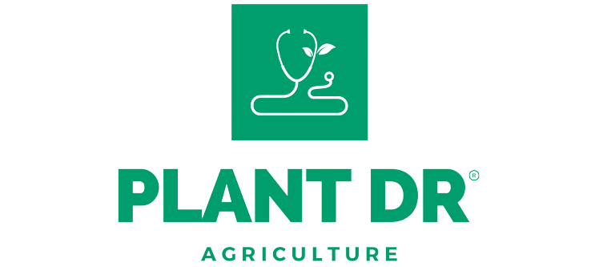

# PLANT DR

Plant Diseases Detection and Treatment Recommendation

---



## Deployment

Untuk melihat halaman dashboard dari project, dapat ditekan pada tombol di bawah ini.

[](https://plant-dr.herokuapp.com/)

Atau

```
https://plant-dr.herokuapp.com/
```

## Dataset

Dataset yang kita gunakan adalah dataset gambar dari daun-daun tumbuhan yang terkena penyakit yang bersumber dari kaggle, dataset ini berisi sekitar 28rb gambar dengan 13 jenis tumbuhan dan 38 kelas penyakit, namun pada project kali ini kita haya akan menggunakan 3 jenis tumbuhan yaitu jagung, tomat, dan ketang. Dataset ini dapat dilihat di [Kaggle](https://www.kaggle.com/datasets/vipoooool/new-plant-diseases-dataset).

## Objective

Membuat model convolutional neural network yang dapat mendeteksi penyakit pada tumbuhan jagung, tomat, dan kentang berdasarkan kondisi daunnya dan memberikan rekomendasi penanganan terhadap penyakit tersebut.
